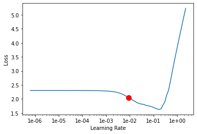

# KeraTorch
> Implementing Keras clone with pytorch backend.


## Install

`pip install keratorch`

## How to use

```python
from keraTorch.model import Sequential
from keraTorch.layers import *
from keraTorch.losses import *
```

The data:

```python
x_train.shape, y_train.shape, x_valid.shape, y_valid.shape
```


    ((50000, 784), (50000,), (10000, 784), (10000,))


Model definition:

```python
model = Sequential()
model.add(Dense(100, x_train.shape[1], activation='relu'))
model.add(Dense(50, activation='relu'))
model.add(Dense(10))
model.add(Activation('softmax'))
```

Doesn't actually compile anything but to look like keras we specify the loss as:

```python
model.compile(ce4softmax)
```

Burrow for Fastai's learning rate finder to find best learning rate:

```python
bs = 256
model.lr_find(x_train, y_train, bs=bs)
```


    <div>
        <style>
            /* Turns off some styling */
            progress {
                /* gets rid of default border in Firefox and Opera. */
                border: none;
                /* Needs to be in here for Safari polyfill so background images work as expected. */
                background-size: auto;
            }
            .progress-bar-interrupted, .progress-bar-interrupted::-webkit-progress-bar {
                background: #F44336;
            }
        </style>
      <progress value='25' class='' max='34' style='width:300px; height:20px; vertical-align: middle;'></progress>
      73.53% [25/34 00:00<00:00]
    </div>

<table border="1" class="dataframe">
  <thead>
    <tr style="text-align: left;">
      <th>epoch</th>
      <th>train_loss</th>
      <th>valid_loss</th>
      <th>time</th>
    </tr>
  </thead>
  <tbody>
    <tr>
      <td>0</td>
      <td>2.301613</td>
      <td>#na#</td>
      <td>00:00</td>
    </tr>
    <tr>
      <td>1</td>
      <td>2.301608</td>
      <td>#na#</td>
      <td>00:00</td>
    </tr>
    <tr>
      <td>2</td>
      <td>2.301600</td>
      <td>#na#</td>
      <td>00:00</td>
    </tr>
    <tr>
      <td>3</td>
      <td>2.301588</td>
      <td>#na#</td>
      <td>00:00</td>
    </tr>
    <tr>
      <td>4</td>
      <td>2.301569</td>
      <td>#na#</td>
      <td>00:00</td>
    </tr>
    <tr>
      <td>5</td>
      <td>2.301540</td>
      <td>#na#</td>
      <td>00:00</td>
    </tr>
    <tr>
      <td>6</td>
      <td>2.301493</td>
      <td>#na#</td>
      <td>00:00</td>
    </tr>
    <tr>
      <td>7</td>
      <td>2.301417</td>
      <td>#na#</td>
      <td>00:00</td>
    </tr>
    <tr>
      <td>8</td>
      <td>2.301294</td>
      <td>#na#</td>
      <td>00:00</td>
    </tr>
    <tr>
      <td>9</td>
      <td>2.301092</td>
      <td>#na#</td>
      <td>00:00</td>
    </tr>
    <tr>
      <td>10</td>
      <td>2.300761</td>
      <td>#na#</td>
      <td>00:00</td>
    </tr>
    <tr>
      <td>11</td>
      <td>2.300216</td>
      <td>#na#</td>
      <td>00:00</td>
    </tr>
    <tr>
      <td>12</td>
      <td>2.299308</td>
      <td>#na#</td>
      <td>00:00</td>
    </tr>
    <tr>
      <td>13</td>
      <td>2.297771</td>
      <td>#na#</td>
      <td>00:00</td>
    </tr>
    <tr>
      <td>14</td>
      <td>2.295127</td>
      <td>#na#</td>
      <td>00:00</td>
    </tr>
    <tr>
      <td>15</td>
      <td>2.290489</td>
      <td>#na#</td>
      <td>00:00</td>
    </tr>
    <tr>
      <td>16</td>
      <td>2.281993</td>
      <td>#na#</td>
      <td>00:00</td>
    </tr>
    <tr>
      <td>17</td>
      <td>2.265558</td>
      <td>#na#</td>
      <td>00:00</td>
    </tr>
    <tr>
      <td>18</td>
      <td>2.230882</td>
      <td>#na#</td>
      <td>00:00</td>
    </tr>
    <tr>
      <td>19</td>
      <td>2.157919</td>
      <td>#na#</td>
      <td>00:00</td>
    </tr>
    <tr>
      <td>20</td>
      <td>2.041476</td>
      <td>#na#</td>
      <td>00:00</td>
    </tr>
    <tr>
      <td>21</td>
      <td>1.920061</td>
      <td>#na#</td>
      <td>00:00</td>
    </tr>
    <tr>
      <td>22</td>
      <td>1.823919</td>
      <td>#na#</td>
      <td>00:00</td>
    </tr>
    <tr>
      <td>23</td>
      <td>1.768780</td>
      <td>#na#</td>
      <td>00:00</td>
    </tr>
    <tr>
      <td>24</td>
      <td>1.723490</td>
      <td>#na#</td>
      <td>00:00</td>
    </tr>
    <tr>
      <td>25</td>
      <td>1.641395</td>
      <td>#na#</td>
      <td>00:00</td>
    </tr>
    <tr>
      <td>26</td>
      <td>1.776127</td>
      <td>#na#</td>
      <td>00:00</td>
    </tr>
    <tr>
      <td>27</td>
      <td>2.319300</td>
      <td>#na#</td>
      <td>00:00</td>
    </tr>
    <tr>
      <td>28</td>
      <td>3.339199</td>
      <td>#na#</td>
      <td>00:00</td>
    </tr>
    <tr>
      <td>29</td>
      <td>4.307324</td>
      <td>#na#</td>
      <td>00:00</td>
    </tr>
    <tr>
      <td>30</td>
      <td>5.229871</td>
      <td>#na#</td>
      <td>00:00</td>
    </tr>
    <tr>
      <td>31</td>
      <td>6.128597</td>
      <td>#na#</td>
      <td>00:00</td>
    </tr>
  </tbody>
</table><p>

    <div>
        <style>
            /* Turns off some styling */
            progress {
                /* gets rid of default border in Firefox and Opera. */
                border: none;
                /* Needs to be in here for Safari polyfill so background images work as expected. */
                background-size: auto;
            }
            .progress-bar-interrupted, .progress-bar-interrupted::-webkit-progress-bar {
                background: #F44336;
            }
        </style>
      <progress value='1' class='' max='3' style='width:300px; height:20px; vertical-align: middle;'></progress>
      33.33% [1/3 00:00<00:00 6.4181]
    </div>


    LR Finder is complete, type {learner_name}.recorder.plot() to see the graph.
    Min numerical gradient: 9.12E-03
    Min loss divided by 10: 1.74E-02





We have the same `.fit` and `.predict` functions:

```python
model.fit(x_train, y_train, bs, epochs=5, lr=1e-2)
```


<table border="1" class="dataframe">
  <thead>
    <tr style="text-align: left;">
      <th>epoch</th>
      <th>train_loss</th>
      <th>valid_loss</th>
      <th>time</th>
    </tr>
  </thead>
  <tbody>
    <tr>
      <td>0</td>
      <td>2.294942</td>
      <td>2.212783</td>
      <td>00:01</td>
    </tr>
    <tr>
      <td>1</td>
      <td>2.163815</td>
      <td>1.622664</td>
      <td>00:01</td>
    </tr>
    <tr>
      <td>2</td>
      <td>1.856739</td>
      <td>1.071931</td>
      <td>00:01</td>
    </tr>
    <tr>
      <td>3</td>
      <td>1.548884</td>
      <td>0.879702</td>
      <td>00:01</td>
    </tr>
    <tr>
      <td>4</td>
      <td>1.325464</td>
      <td>0.846312</td>
      <td>00:01</td>
    </tr>
  </tbody>
</table>


```python
preds = model.predict(x_valid)
accuracy = (preds.argmax(axis=-1) == y_valid).mean()
print(f'Predicted accuracy is {accuracy:.2f}')
```

    Predicted accuracy is 0.77

