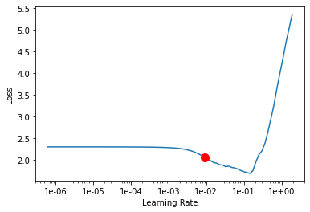

# KeraTorch
> Implementing Keras clone with pytorch backend.


## Install

`pip install keratorch`

## How to use

```python
from keraTorch.model import Sequential
from keraTorch.layers import *
from keraTorch.losses import *
```

The data:

```python
x_train.shape, y_train.shape, x_valid.shape, y_valid.shape
```


    ((50000, 784), (50000,), (10000, 784), (10000,))


Model definition:

```python
model = Sequential()
model.add(Dense(100, x_train.shape[1], activation='relu'))
model.add(Dense(50, activation='relu'))
model.add(Dense(10))
model.add(Activation('softmax'))
```

Doesn't actually compile anything but to look like keras we specify the loss as below. `ce4softmax` means crossentropy for softmax loss.

```python
model.compile(ce4softmax)
```

Burrow for Fastai's learning rate finder to find best learning rate:

```python
bs = 256
model.lr_find(x_train, y_train, bs=bs)
```

    Min numerical gradient: 9.12E-03
    Min loss divided by 10: 1.45E-02





We have the same `.fit` and `.predict` functions:

```python
model.fit(x_train, y_train, bs, epochs=10, lr=1e-2)
```


<table border="1" class="dataframe">
  <thead>
    <tr style="text-align: left;">
      <th>epoch</th>
      <th>train_loss</th>
      <th>valid_loss</th>
      <th>time</th>
    </tr>
  </thead>
  <tbody>
    <tr>
      <td>0</td>
      <td>2.298158</td>
      <td>2.270433</td>
      <td>00:01</td>
    </tr>
    <tr>
      <td>1</td>
      <td>2.249195</td>
      <td>2.054905</td>
      <td>00:01</td>
    </tr>
    <tr>
      <td>2</td>
      <td>2.082948</td>
      <td>1.474771</td>
      <td>00:01</td>
    </tr>
    <tr>
      <td>3</td>
      <td>1.806854</td>
      <td>0.904923</td>
      <td>00:01</td>
    </tr>
    <tr>
      <td>4</td>
      <td>1.526004</td>
      <td>0.737786</td>
      <td>00:01</td>
    </tr>
    <tr>
      <td>5</td>
      <td>1.293055</td>
      <td>0.705958</td>
      <td>00:01</td>
    </tr>
    <tr>
      <td>6</td>
      <td>1.105806</td>
      <td>0.666755</td>
      <td>00:01</td>
    </tr>
    <tr>
      <td>7</td>
      <td>0.958004</td>
      <td>0.687373</td>
      <td>00:01</td>
    </tr>
    <tr>
      <td>8</td>
      <td>0.838495</td>
      <td>0.696255</td>
      <td>00:01</td>
    </tr>
    <tr>
      <td>9</td>
      <td>0.741785</td>
      <td>0.697341</td>
      <td>00:01</td>
    </tr>
  </tbody>
</table>


```python
preds = model.predict(x_valid)
accuracy = (preds.argmax(axis=-1) == y_valid).mean()
print(f'Predicted accuracy is {accuracy:.2f}')
```

    Predicted accuracy is 0.81

